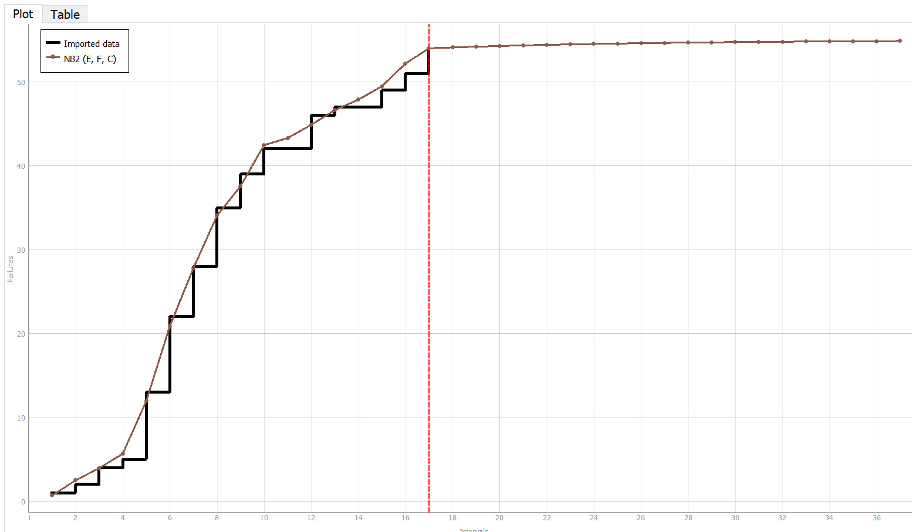

**SENG 438- Software Testing, Reliability, and Quality**

**Lab. Report \#5 – Software Reliability Assessment**

| Group \#:       | 3  |
|-----------------|---|
| Student Names:  | Avijot Girn  |
|                 | Aaron Frerichs  |
|                 | Ethan Subasic  |
|                 | Jesse Gerbrandt  |

# Introduction

# 

# Assessment Using Reliability Growth Testing 
Result of Model Comparison:
Using the C-SFRAT tool, multiple models were able to be compared in order to discover the most accurate model to depict the data analyzed. The following methods were compared using this tool:
-IFR generalized Salvia & Bollinger
-S Distribution
-Discrete Weibull (Order 2)
-Discrete Weibull (Type III)
-Geometric
-Negative Binomial (Order 2)
-Truncated Logistic

The two most effective models found were the S Distribution and Negative Binomial (Order 2) methods. Using the C-SFRAT tool, Model Comparison was used to deduce these two models as the most effective. As shown in the figure below, these 2 models have the closest Critic to 1. This points to these models being the most accuate to the input data.

Additionally, the MVF and Intensity Graphs for these two models can be seen labelled below.

S Distribution MVF:

S Distribution Intensity Graph:

Negative Binomial (Order 2) MVF:

Negative Binomial (Order 2) Intensity Graph:

Range Analysis:
Data ranges had to be analyzed in order for the tool to extrapolate the models and predict future failures. As other tools were unable to work and C-SFRAT was unable to calculate calculate Laplace tests, the ranges were set to extrapolate 20 intervals past the end of the data. Ideally, the Laplace test would be able to determine an optimal range to calculate this bound. However, due to the constraints of the software used, the range of 20 intervals was chosen.

Failure Rate:
As C-SFRAT was unable to calculate failrue rates, this value was replaced with failure intensity, which is calculated with the Intensity graphs included above. The plots were calculated with a failure intensity of 0.5, yielding an optimal quantity of testing required for the intensity of failures.

Advantages and Distadvantages of Reliability Growth Analysis:
A clear advantage of the Reliability Growth Analysis is the quantity of unique plots and models that are able to be analyzed. The C-SFRAT tool provided 6 different models with further specification for using specific variables included in the data set. This multitude of models allows testers to find the most optimal model to suit their data. Additionally, this type of analysis shows testers how their program experiences failures over time and is able to extrapolate the given data to predict future failures. 
Disadvantages of Reliability Growth Analysis consists of the dependency of the software to have access to many failures in order to have a sufficient data set to make predictions. This limitation can be hazardous for programs that do not contain many failures to analyze. 

# Assessment Using Reliability Demonstration Chart 
 It can be observed that the use of RDC (Reliability Demonstration Chart) for the evaluation of a project, yields diverse outcomes based on the chosen metrics. The three figures presented below demonstrate that the dependability of the program could either be acceptable or not reliable enough based on the MTTF being used.

 
 _1 fail per 500 seconds_

For an acceptable failure rate of 1 failure for every 500 seconds, the software displays a clearly acceptable behaviour as the curve of fails is seen to drop deep into the green. By the metric set here the software is reliable enough and should be easily accepted.
#

 _1 fail per 1000 seconds_

The selection of the MTTF value used in this graph was based on data analysis, a value was chosen where the RDC mostly remained within the continue testing range. This value also demonstrated then effects of halving and doubling the MTTF value clearly, as seen in the previous (halving) and succeeding (doubling) graphs. For an acceptable failure rate of 1 failure for every 1000 seconds, the software is much less acceptable by the new metrics since the project is under more harsh requirement not to fail. Though the software is much less acceptable than the pervious image the data mostly stays out of the failure zone and after enough run time even stabalizes in acceptable area, so this software is still acceptable enough. Additional testing may be needed in order to ensure the reliability of the software and to observe any discernible trends that may lead to a more obvious acceptance or rejecction.
#

 _1 fail per 2000 seconds_

For the failure rate of 1 failure every 2000 seconds the curve shoots straight up and consitently sits in the red rejection zone for the entire duration of testing. For this metric the program has demonstraited complete failure and should not be accepted.
# 

# Comparison of Results

# Discussion on Similarity and Differences of the Two Techniques

# How the team work/effort was divided and managed
For this lab, we decided to modify the "pair programming" technique, and split off into pairs to complete the two parts of the lab. While Avijot and Aaron went through part 1, Ethan and Jesse completed part 2. Then both pairs would come together at the end to discuss their findings and challenges. 

# Difficulties encountered, challenges overcome, and lessons learned
One of the greatest difficulties encountered during this lab was getting any of the provided tools to function as intended. In our experiences, every tool provided was outdated and inefficient on newer machines, this was a big problem as nobody in the group was running a system older than windows 10 (or the Mac equivalent). Due to this fact, we had to get constant clarification from TAs in order to overcome these problems. 

The big lesson learned was the fact that not every tool that is available to use, can actually be used. With technology advancing quickly, we need to adapt with tool creation and factor in maintainability as well as scalability when it comes to our programs, not just reliability. 
# Comments/feedback on the lab itself
This lab caused a lot of problems for many group in the class. With outdated tools and lack luster instructions, it was near impossible to navigate the lab, and get a good start on it. After weeks of trial and error with little to no documentation to support the given tools, we were finally able to get our results.

For future classes doing the same lab, we feel that a major refactoring is necessary as this lab was more about understanding outdated software and manually changing given files, than it was about enforcing topics related to software reliability. Furthermore, having the lab demo day be 1 week before the due date caused more strain, as many groups were scrambling to get stuff done rather than understanding and polishing a final product. All in all, very unclear instructions, broken software, and incorrect file formats were major issues for this lab, and did not make it an enjoyable, or an efficient learning assessment. We were able to determine that the problem did not lie in our understanding of the lecture content, as constant cross referencing to the provided notes would just lead to more confusion. This lab was extremely difficult and for all the wrong reasons, perhaps if better tools, documentation, or instructions were provided we would be able to use this "assessment" to learn and reinforce our understanding of the class content, but all we were left with was disappointment and more ambiguity than we started with. 